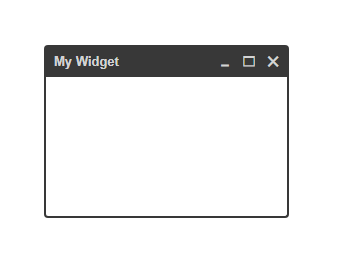

[](https://opensource.org/licenses/MIT)
[](https://travis-ci.org/taitulism/widget)

widget
======
Make elements window-like: a floating titled container, draggable and resizable.



```js
const widget = require('widget-elm');

const myElm = document.getElementById('target');

widget('My Title', myElm, {options});
```

## Options

* **`minWidth`** - Number. Resize minimum width.
* **`minHeight`** - Number. Resize minimum height.
* **`id`** - String. The widget `id` attribute.
* **`classname`** - String. The widget `class` attribute.
* **`showActions`** - Boolean. Show action buttons (maximize, minimize, close).
* **`showClose`** - Boolean. Show the `close` button.
* **`showMinimize`** - Boolean. Show the `minimize` button.
* **`showMaximize`** - Boolean. Show the `maximize` button.
* **`showHeader`** - Boolean. Show the widget header.
* **`toggleHeader`** - Boolean. Toggle the header visibility on hover (show on enter, hide on leave).
* **`toggleActions`** - Boolean. Toggle the action buttons visibility on hover (show on enter, hide on leave).


## API

>### **IMPORTANT NOTE:** Widget is based on classnames + css. Meaning some of the API methods only manipulate the widget classnames and results can only be seen by using a matching css. You can use `./default-style.css` as a starting point.

&nbsp;

Calling the `widget()` function returns a `Widget` instance: 
```js
const w = widget(elm);
```
It has the following methods:

### **.mount()**
Appends the widget to the `<body>` and binds event listeners.

### **.unmount()**
Removes the widget from the DOM and unbinds event listeners.

### **.show() / .hide()**
Toggle widget visibility.

### **.showHeader() / .hideHeader()**
Toggle widget header visibility.

### **.showActions() / .hideActions()**
Toggle widget action buttons visibility.

### **.minimize()**
Minimizes the widget by hiding its body, only the header is visible.

### **.unMinimize()**
Reverts the `.minimize()` by showing the body. Does not maximize.

### **.maximize()**
Maximizes the widget (fullscreen). Disables drag & resize.

### **.unMaximize()**
Reverts the `.maximize()` to previous widget size. Does not minimize.

### **.restoreSize()**
Reverts both `.minimize()` & `.maximize()`.

### **.setTitle(String)**
Sets a new widget title.

### **.setBody(HTMLElement)**
Sets a new widget body.

### **.setView(title, body)**
Sets a new widget title & body.

### **.destroy()**
Kills the `Widget` instance for good, unbinds events, releases element references.


&nbsp;

>### Position:
>On initialization, the target element will be placed inside the `<body>` element and will be given an inline style of `position: absolute`.
